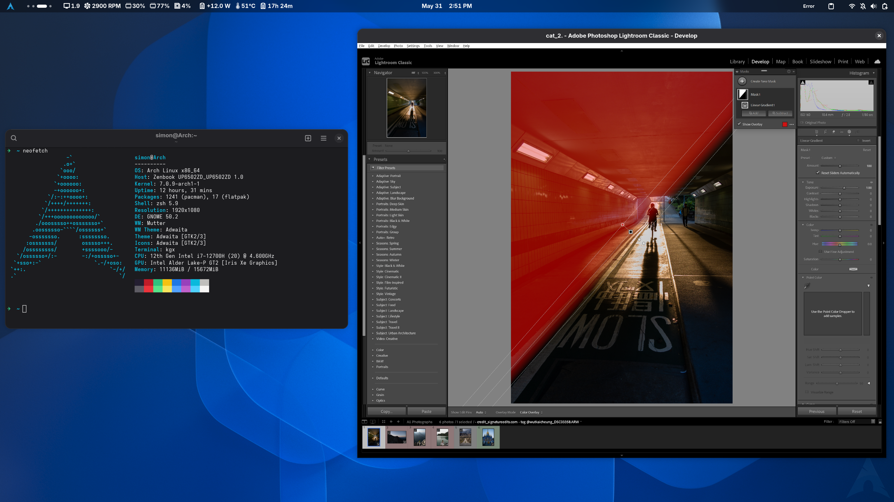

# Adobe Lightroom Classic on Linux via Wine

Run Adobe Lightroom Classic (the local-catalog desktop app, not Lightroom CC)
on Linux with Wine.



Status as of 2026-07-27 with lightroom 15.5.1 on wine 11.12 staging: install, launch, Develop, GPU
acceleration, AI masking and the colour histogram all work. HDR is the only
missing feature. See [`KNOWN_ISSUES.md`](DOCS/KNOWN_ISSUES.md).

> Thanks to [sander110419](https://github.com/sander110419) for the original
> Lightroom-cc-on-linux idea and the patched DLLs (`mfplat`, `d2d1`, `hnetcfg`)
> this project builds on.

## What works

- Install from the standalone `Set-up.exe` or the Creative Cloud app
- Library, Import, Develop and all manual edits
- AI masking: Select Subject, Sky and Objects. It runs on the CPU with Intel
  graphics and on the GPU with AMD Radeon cards.
- AI Denoise on AMD Radeon cards (GPU). Not tested with Intel graphics yet.
- GPU acceleration through vkd3d-proton
- Filled colour histogram, Export and Copy Settings dialogs

HDR has not been verified: it needs the native Wayland driver (now the default
on Wayland sessions) plus an HDR compositor.

## Requirements

- 64-bit Linux with working Vulkan drivers (`vulkan-tools`)
- Wine 11.8 staging or newer
- `winetricks` and `cabextract`
- `mingw-w64` and `gcc`, only if you want to rebuild the helper DLLs (prebuilt
  ones ship in the repo)
- vkd3d-proton (`winetricks vkd3d` or a Proton / GE-Proton runner)
- A valid Lightroom Classic license
- About 10 GB of free disk space

### Tested setups

| | Intel | AMD |
|---|---|---|
| Distro / desktop | Arch Linux, GNOME (Wayland) | Fedora 44, GNOME 50.4 (Wayland) |
| Wine | 11.18 staging | 11.17 staging (Kron4ek build) |
| DXVK / vkd3d-proton | 3.1 / 3.0.0 | 3.1 / 3.0.1 |
| GPU | Intel Iris Xe | Radeon RX 9060 XT and RX 7900 XTX (Mesa 26.1, RADV) |
| Lightroom Classic | 15.5 | 15.3 |
| AI masking | CPU | GPU, about 1.4 s per mask |
| AI Denoise, 26.6 MP raw | not tested | 18.4 s (RX 9060 XT), 8.4 s (RX 7900 XTX) |

On AMD, Lightroom reports full GPU acceleration without any adapter spoofing.
The AMD results come from a user report (#19). NVIDIA hasn't been tested, but
DXVK and vkd3d-proton support it.

With several GPUs, pick the one Lightroom uses with Mesa's device selector, for
example `MESA_VK_DEVICE_SELECT=1002:744c!` for a card with PCI ID `1002:744c`
(`vulkaninfo --summary` lists them).

## Install

```bash
git clone https://github.com/6im0n/lightroom-classic-on-linux.git
cd lightroom-classic-on-linux
./start.sh
```

`start.sh` opens a menu and marks the recommended next step with an arrow.

### 1. Get Adobe's installer

You need one of these:

- The Creative Cloud online installer (menu route `3`, recommended). Download
  `Creative_Cloud_Set-Up.exe` from
  [Adobe's Creative Cloud download page](https://creativecloud.adobe.com/apps/download/creative-cloud)
  and put it in `resources/installers/`. Adobe's site detects Linux and won't
  offer the Windows installer, so set your browser to report Windows with a
  user-agent switcher extension first (for example
  [User-Agent Switcher](https://addons.mozilla.org/fr/firefox/addon/uaswitcher/)
  for Firefox).
- The Creative Cloud offline installer (menu route `4`). Download the
  `ACCCx*.zip` from Adobe's
  [direct download links page](https://helpx.adobe.com/download-install/apps/download-install-apps/creative-cloud-apps/download-creative-cloud-desktop-app-using-direct-links.html)
  and put it in `resources/installers/`. This is an older version of the app,
  and its Creative Cloud panels stay blank under wine.
- The standalone Lightroom Classic installer (menu route `5`). Put Adobe's
  offline `Set-up.exe` and its `products/`, `resources/` and `packages/`
  folders in `resources/installers/lightroom/`.

### 2. Run the menu steps in order

| Step | What it does |
|------|--------------|
| `1`  | Prepare the wine prefix |
| `2`  | Install GPU acceleration |
| `3`, `4` or `5` | Install Lightroom Classic, using the route that matches your installer |
| `6`  | Post-install fixes |
| `a`  | Enable AI masking (optional, recommended) |
| `7`  | Run Lightroom Classic |

Other entries: `g` adds a desktop launcher, `d` changes the UI scale, `w`
switches the graphics driver (Wayland on a Wayland session by default, X11
otherwise), and `8` runs Lightroom in a virtual desktop if the normal launch
crashes.

If an app hangs or won't relaunch, pick `k` in the menu (`wineserver -k`). It
keeps your install.

## Learn more

- [`GUIDE.md`](DOCS/GUIDE.md) explains every script and fix, the manual steps, and
  the environment variables (`LR_DPI`, `LR_DRIVER`, `LR_MASKING`, …).
- [`KNOWN_ISSUES.md`](DOCS/KNOWN_ISSUES.md) lists open and solved issues, and what a
  wine upgrade resets.

### How it works

- A patched `d2d1.dll` adds a colour-management passthrough and layer masks.
  Lightroom needs these to start, draw the histogram and show thumbnails.
- A patched `mfplat.dll` and a `hnetcfg.dll` stub fill in Windows pieces
  Lightroom loads at startup.
- `winrt_inmemstream.dll` and `fakeram.so` make AI masking work.
- A proxy `version.dll` fixes dialog repaint glitches.
- With the native Wayland driver, a small preload (`wlstack.so`) keeps menus
  above the GPU-drawn photo.
- A `dcomp.dll` built from wine-staging 11.10, used only by Edge WebView2,
  stops the Creative Cloud sign-in page from crash-looping and filling RAM.
  WebView2 also renders through wined3d instead of DXVK (DXVK 3.1 leaked GPU
  memory there), and its `msedge.dll` is page-aligned so its processes share
  one copy.
- A small WinRT stub provides the toast notifications the Creative Cloud app
  asks for at startup; without it the app crashes.
- vkd3d-proton provides real D3D12, so Lightroom detects the GPU.
- The setup also sets the Windows version to 11, turns off `winegstreamer`
  during install, adds lowercase DLL symlinks and sets a few per-app registry
  values.
